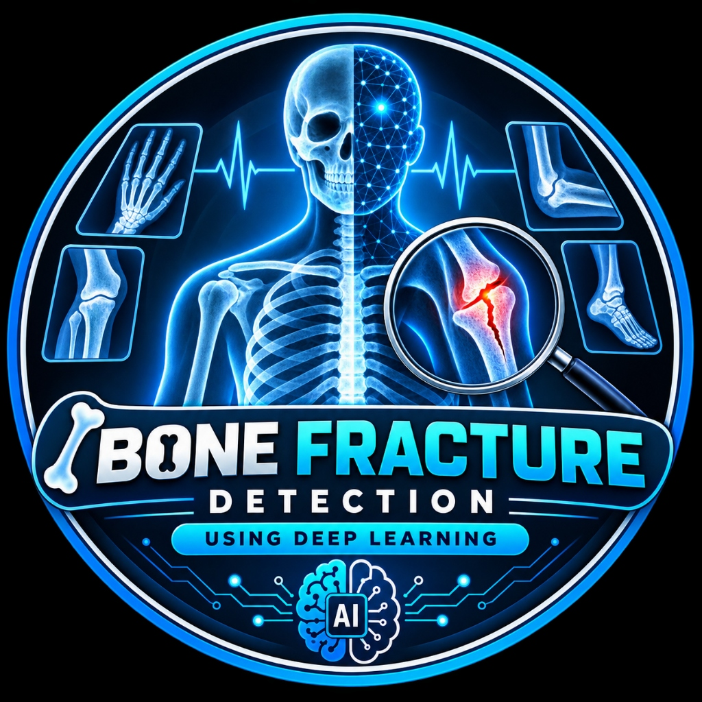

<div align="center">
  
  <h1>🩻 Bone Fracture Detection — X-Ray AI Engine</h1>
  <p>An end-to-end Medical Deep Learning system for detecting bone fractures in X-ray images with <b>Grad-CAM visual explainability</b>, <b>CLAHE contrast enhancement</b>, an interactive <b>Streamlit Web Application</b>, and a <b>FastAPI REST API</b>.</p>
</div>

---

## 🌟 Key Features

- **Advanced Deep Learning Backbones**: Supports Transfer Learning with **ResNet50, ResNet34, ResNet18, DenseNet121, EfficientNet-B0**, and a custom lightweight CNN.
- **Grad-CAM Visual Attention**: Explains model decisions by generating visual attention heatmaps that pinpoint exact fracture fissures and cortical disruptions.
- **Fracture Localization (ROI)**: Automatically detects and highlights regions of interest (bounding boxes) on suspicious fracture zones.
- **Medical Contrast Enhancement (CLAHE)**: Enhances bone radiopacity and fine trabecular patterns.
- **Interactive Streamlit Web Dashboard**:
  - **Single X-Ray Studio**: Instant diagnosis, confidence breakdown, side-by-side 4-way visual comparison, and downloadable medical report.
  - **Sample Scans Gallery**: Pre-loaded demo scans for immediate testing.
  - **Batch Processing**: High-throughput triage screening with CSV export.
  - **Model Analytics**: Confusion matrix, ROC-AUC curve, and training loss/accuracy curves.
  - **Interactive Retraining**: Train new models with customized backbones and hyperparameters right from the UI.
- **FastAPI REST Service**: Headless API endpoint for integration into PACS/HIS hospital systems, web apps, or mobile clients.
- **Synthetic X-Ray Generator**: Generates anatomically plausible synthetic X-rays with cortical bone gradients and fracture lines for testing.

---

## 📂 Project Structure

```
Bone fracture/
│
├── data/                             # Dataset Directory
│   ├── sample_images/                # Demo X-rays for instant testing
│   ├── train/                        # Training split (fractured / normal)
│   ├── val/                          # Validation split
│   └── test/                         # Test split
│
├── models/                           # Saved Weights & Evaluation Plots
│   ├── best_model.pth                # Checkpoint of highest performing model
│   ├── learning_curves.png           # Loss and Accuracy curves
│   └── evaluation/                   # Confusion matrix & ROC-AUC curves
│
├── src/                              # Source Code Package
│   ├── __init__.py
│   ├── model.py                      # ResNet / DenseNet / EfficientNet architectures
│   ├── gradcam.py                    # Grad-CAM heatmap & bounding box ROI
│   ├── dataset.py                    # PyTorch Dataset & Medical Augmentations
│   ├── predictor.py                  # High-level inference & explanation engine
│   ├── train.py                      # Training loop with early stopping & scheduler
│   ├── evaluate.py                   # Classification report, ROC, and Confusion Matrix
│   └── utils.py                      # CLAHE filter, synthetic data generator, report maker
│
├── app.py                            # Streamlit Web Application
├── api.py                            # FastAPI REST API Backend
├── generate_demo_data.py             # Setup script: builds demo dataset & baseline model
├── requirements.txt                  # Python dependencies
├── run_app.bat                       # 1-Click launcher for Web App (Windows)
├── run_train.bat                     # 1-Click launcher for Training (Windows)
└── README.md                         # Documentation
```

---

## 🚀 How to Run the Project

### Option 1: 1-Click Launch (Windows)
Simply double-click:
```bash
run_app.bat
```
*(If it's your first time, it will automatically initialize the dataset and baseline model, then start the web interface).*

---

### Option 2: Step-by-Step Terminal Execution

#### Step 1: Install Dependencies
```bash
python -m pip install -r requirements.txt
```

#### Step 2: Initialize Dataset & Baseline Model
```bash
python generate_demo_data.py
```

#### Step 3: Launch the Streamlit Web Application
```bash
streamlit run app.py
```
*Open your browser at `http://localhost:8501` to start diagnosing X-rays.*

---

### Option 3: Run the FastAPI REST API
To start the REST server for API integrations:
```bash
python api.py
```
*Access interactive Swagger API documentation at: `http://localhost:8000/docs`*

#### Sample API Request (Python):
```python
import requests

url = "http://localhost:8000/predict"
files = {"file": open("data/sample_images/demo_fractured_radius.png", "rb")}
response = requests.post(url, files=files)
print(response.json())
```

---

## 🧠 Training on Your Own Dataset (e.g. Kaggle / MURA)

You can easily train the model on real datasets (e.g., [Kaggle Bone Fracture Dataset](https://www.kaggle.com/datasets/bmadushanirodrigo/fracture-multi-region-x-ray-data) or Stanford MURA).

1. Place your images inside the `data/` folder following this structure:
   ```
   data/
   ├── train/
   │   ├── normal/       # Intact bone X-rays
   │   └── fractured/    # Fractured bone X-rays
   └── val/
       ├── normal/
       └── fractured/
   ```

2. Run the training script:
   ```bash
   python -m src.train --arch resnet50 --epochs 20 --batch_size 16 --lr 0.0001
   ```

3. Evaluate the trained model:
   ```bash
   python -m src.evaluate --model_path models/best_model.pth --data_dir data --split val
   ```

---

## 🔬 Explainable AI (Grad-CAM)

Medical AI requires trust and transparency. This system uses **Grad-CAM (Gradient-weighted Class Activation Mapping)** to compute gradients flowing into the final convolutional layer.

- **Red/Yellow zones**: High attention region indicating suspected bone discontinuity.
- **Blue/Cyan zones**: Background osseous structures deemed normal.
- **Bounding Boxes**: Automated detection of cortical step-offs and fracture lines.

---

## 📋 Technology Stack

- **Deep Learning**: PyTorch, Torchvision, CUDA (optional CPU support)
- **Computer Vision**: OpenCV, PIL, Scikit-Image
- **Explainability**: Custom PyTorch Grad-CAM Hook Engine
- **Web UI**: Streamlit, Pandas, Matplotlib, Seaborn
- **Backend API**: FastAPI, Uvicorn, Pydantic

